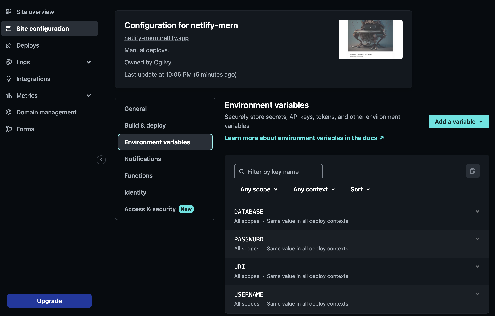

[](https://www.npmjs.com/)
[](https://nodejs.org/en/)
[](https://zh-hant.reactjs.org/)
[](https://www.typescriptlang.org/)
[](https://lesscss.org/)
[](https://tailwindcss.com/)
[](https://reactrouter.com/)
[](https://expressjs.com/)
[](https://www.netlify.com/)

<p align="center">
  <a href="https://github.com/jameshsu1125">
    
  </a>
  <h3 align="center">template-netlify-mern</h3>
  <p align="center">
    Vite + React + TypeScript 前端，搭配 Netlify Functions（Express）與 MongoDB 的全端專案範本，內建後台管理介面。
  </p>
</p>

## 目錄

- [這個專案是什麼](#這個專案是什麼)
- [功能一覽](#功能一覽)
- [技術架構](#技術架構)
- [快速開始](#快速開始)
- [環境變數](#環境變數)
- [常用指令](#常用指令)
- [專案結構與文件索引](#專案結構與文件索引)
- [運作方式](#運作方式)
- [如何擴充](#如何擴充)
- [建置與部署](#建置與部署)
- [已知限制與安全注意事項](#已知限制與安全注意事項)
- [常見問題](#常見問題)
- [命名慣例](#命名慣例)
- [相依套件安全性（npm audit）](#相依套件安全性npm-audit)
- [專案現況](#專案現況)
- [貢獻方式](#貢獻方式)
- [作者與授權](#作者與授權)

## 這個專案是什麼

這是一個可以直接拿來開新專案的範本。它把一個小型網站常需要的東西先接好：

- 前台網站（目前只有一個空白首頁，等你自己填內容）。
- 後台管理介面，網址是 `/admin`，登入後可以管理使用者、上傳圖片、編輯富文字內容。
- 後端 API，以 Netlify Functions 執行，連接 MongoDB，並處理圖片上傳。

你只要設定好環境變數、修改資料表定義，就可以在這個基礎上開發自己的功能。

## 功能一覽

| 功能 | 說明 | 位置 |
| :-- | :-- | :-- |
| Auth0 登入 | 後台使用 Auth0 登入，登入後由後端比對使用者清單並簽發 token | `src/pages/login`、`src/pages/router.tsx` |
| 使用者管理 | 管理員可新增、刪除使用者並指定權限（僅 `admin` 可進入） | `src/pages/user` |
| 相簿 | 瀏覽、上傳、複製網址、刪除圖片與資料夾，支援 Cloudinary 與 BunnyCDN | `src/components/album` |
| 富文字編輯器 | 以 Tiptap 編輯內容，可從相簿插入圖片，內容存進 MongoDB | `src/pages/editor`、`src/components/tiptab` |
| 全域提示元件 | Loading、Alert、Modal，透過全域狀態在任何地方呼叫 | `src/components/loadingProcess` 等 |
| API Mock | 以 MSW 在瀏覽器端攔截 API，沒有後端也能開發 | `src/mocks` |
| 一鍵部署 | 互動式選擇 gh-pages、Netlify 預覽或 Netlify 正式環境 | `scripts/deploy.js` |

## 技術架構

```text
瀏覽器
  │
  │  /admin  ──► 後台（需 Auth0 登入）
  │  其他路徑 ──► 前台（公開）
  ▼
Vite + React 19（src/）
  │  所有資料請求透過 src/hooks 內的 hooks，經 lesca-fetcher 送出
  ▼
/api/*  ──(netlify.toml 轉發)──►  /.netlify/functions/api/*
                                    │
                                    ▼
                         Express（netlify/functions/api/api.ts）
                           ├─ MongoDB（mongoose）：select / insert / update / delete
                           └─ 圖片儲存：Cloudinary 或 BunnyCDN（sharp 先轉成 webp）
```

主要套件：

| 用途 | 套件 |
| :-- | :-- |
| 前端框架 | React 19、React Router 7 |
| 建置工具 | Vite、TypeScript |
| 樣式 | Tailwind CSS 4 + daisyUI、Less |
| 登入 | Auth0（`@auth0/auth0-react`） |
| 富文字 | Tiptap 3 |
| 後端 | Express、serverless-http、mongoose |
| 圖片 | Cloudinary、BunnyCDN（`lesca-node-bunnycdn`）、sharp |
| API Mock | MSW、@faker-js/faker |

## 快速開始

### 1. 事前準備

- Node.js v18 以上。
- 一個 MongoDB 連線（例如 MongoDB Atlas）。
- 一個 Auth0 應用程式（Single Page Application）。
- Cloudinary 或 BunnyCDN 帳號（只使用相簿功能時才需要）。
- 全域安裝 Netlify CLI：

  ```sh
  npm install netlify-cli -g
  ```

### 2. 安裝套件

```sh
npm install
```

### 3. 建立環境變數檔

專案需要兩份 `.env.local`，兩份都不會被 git 追蹤。

```sh
# 後端（Netlify Functions）使用
cp .env.defaults .env.local

# 前端（Vite）使用
cp src/pages/.env.defaults src/pages/.env.local
```

接著依照下一節的說明填入自己的值。

### 4. 啟動開發環境

```sh
npm run dev
```

這個指令會先啟動 `netlify dev`（後端與轉發），等到出現 `Local dev server ready` 之後，再自動啟動 `vite --host`（前端）。啟動後：

- 前端：`https://localhost:5173`（使用 mkcert 產生的本機憑證）。
- 後端：`http://localhost:8888`，前端的 `/api` 會自動代理過去。
- 後台：`https://localhost:5173/admin`。

> 如果 Netlify CLI 或 Vite 偶爾當掉，停止後重新執行 `npm run dev` 即可。

## 環境變數

### 後端：根目錄 `.env.local`

| 變數 | 必填 | 說明 |
| :-- | :-: | :-- |
| `URI` | 是 | MongoDB 連線字串前半段。後端實際連線的是 `URI` 與 `DATABASE` 直接相接，所以 `URI` 結尾要包含 `/` |
| `DATABASE` | 是 | 資料庫名稱 |
| `AMIN_EMAIL` | 是 | 超級管理員的 email。拼字是 `AMIN`（少了 D），這是程式碼目前使用的名稱，請照寫 |
| `CLOUD_STORAGE_TYPE` | 否 | 圖片儲存位置，填 `cloudinary` 使用 Cloudinary，其他值或不填則使用 BunnyCDN |
| `CLOUDINARY_NAME` | 使用 Cloudinary 時 | Cloudinary cloud name |
| `CLOUDINARY_API_KEY` | 使用 Cloudinary 時 | Cloudinary API key |
| `CLOUDINARY_API_SECRET` | 使用 Cloudinary 時 | Cloudinary API secret |
| `CLOUDINARY_BASE_FOLDER` | 使用 Cloudinary 時 | 所有圖片存放的根資料夾 |
| `BUNNY_PASSWORD` | 使用 BunnyCDN 時 | Storage Zone 的存取密碼，預設 `unset` |
| `BUNNY_STORAGE_ZONE` | 使用 BunnyCDN 時 | Storage Zone 名稱，預設 `demo` |
| `BUNNY_FOLDER_NAME` | 否 | 根資料夾名稱，預設為空 |
| `BUNNY_REGION` | 否 | 區域代碼，預設 `SG` |

> `.env.defaults` 目前只列出 MongoDB、Cloudinary 與管理員 email；BunnyCDN 與 `CLOUD_STORAGE_TYPE` 是程式碼支援、但範本檔尚未列出的變數，需要時請自行加入。

### 前端：`src/pages/.env.local`

前端變數必須以 `VITE_` 開頭，才會被 Vite 打包進瀏覽器端程式碼。

| 變數 | 說明 |
| :-- | :-- |
| `VITE_TITLE` | 網站標題，同時顯示在後台導覽列與 HTML `<title>` |
| `VITE_SUBSCRIPTION` | 網站描述，用於 `og:description` |
| `VITE_URL` | 網站網址，用於 `og:url`，也是 gh-pages 部署後自動開啟的網址 |
| `VITE_FACEBOOK_ID` | Facebook App ID，用於 `fb:app_id` |
| `VITE_DEFAULT_THEME` | 預設的 daisyUI 主題，例如 `light`、`cupcake`、`luxury` |
| `VITE_404_CONTACT_ADDRESS` | 404 頁面「Contact support」連結使用的 email |
| `VITE_MOCKING` | 填 `true` 時啟用 MSW，由瀏覽器端攔截 API |
| `VITE_API_PATH` | 正式環境的 API 位址，不填則使用 `./api` |
| `VITE_API_PATH_DEV` | 本機開發（hostname 為 `localhost`）的 API 位址 |
| `VITE_AUTH0_DOMAIN` | Auth0 網域 |
| `VITE_AUTH0_CLIENT_ID` | 正式環境使用的 Auth0 Client ID |
| `VITE_AUTH0_CLIENT_ID_DEV` | 本機開發使用的 Auth0 Client ID |

> 請不要把真實的金鑰、密碼提交到版本庫。`.env.local` 已列在 `.gitignore`。

### Auth0 設定提醒

在 Auth0 的 Application 設定裡，把下列網址加入 Allowed Callback URLs、Allowed Logout URLs 與 Allowed Web Origins：

- 本機：`https://localhost:5173/admin`
- 正式環境：`https://你的網域/admin`

## 常用指令

| 指令 | 說明 |
| :-- | :-- |
| `npm run dev` | 啟動 `netlify dev`，就緒後再啟動 Vite 開發伺服器 |
| `npm run build` | 先做 TypeScript 型別檢查，再用 Vite 打包到 `dist/` |
| `npm run preview` | 預覽打包後的結果 |
| `npm run lint` | 執行 ESLint，有任何警告都會失敗 |
| `npm run deploy` | 互動式部署（見[建置與部署](#建置與部署)） |
| `npm run rm` | 刪除 `node_modules/`、`dist/` 與 `package-lock.json`，用於徹底重裝 |

專案沒有單元測試，修改完成後請至少確認 `npm run lint` 與 `npm run build` 都能通過。

## 專案結構與文件索引

每個主要資料夾都有自己的說明文件，請從下表進入：

| 路徑 | 內容 | 說明文件 |
| :-- | :-- | :-- |
| `src/pages/` | 應用程式進入點、路由與各個頁面 | [src/pages/README.md](src/pages/README.md) |
| `src/components/` | 共用 UI 元件 | [src/components/README.md](src/components/README.md) |
| `src/hooks/` | 呼叫後端 API 的 hooks | [src/hooks/README.md](src/hooks/README.md) |
| `src/settings/` | 全域狀態、型別、設定值 | [src/settings/README.md](src/settings/README.md) |
| `src/mocks/` | MSW API 模擬 | [src/mocks/README.md](src/mocks/README.md) |
| `netlify/functions/` | 後端 API 與資料模型 | [netlify/functions/README.md](netlify/functions/README.md) |
| `setting/` | 資料表 schema 與共用型別 | [setting/README.md](setting/README.md) |
| `scripts/` | 開發與部署腳本 | [scripts/README.md](scripts/README.md) |
| `public/` | 靜態資源，打包時原樣複製到 `dist/` | 見下方說明 |

其他重要檔案：

| 檔案 | 說明 |
| :-- | :-- |
| `vite.config.ts` | Vite 設定：根目錄為 `src/pages`、輸出到 `dist`、`@` 別名、`/api` 代理到 `localhost:8888`、注入 HTML 變數 |
| `netlify.toml` | Netlify 設定：Functions 打包方式、`/api/*` 轉發規則、CORS header |
| `public/_redirects` | 靜態站轉發：`/api/*` 轉到 Functions，`/admin`、`/album` 回到 `index.html` |
| `tailwind.config.css` | Tailwind 4 與 daisyUI 設定（啟用全部主題） |
| `AGENTS.md` | 給 AI coding agent 讀的專案指引（人類不需要閱讀） |

## 運作方式

### 前台與後台

`src/pages/app.tsx` 會依照網址決定載入哪一個應用程式：

- 網址以 `/admin` 開頭：載入後台（`AdminApp`），包在 Auth0 Provider 內，路由基底為 `/admin`。
- 其他網址：載入前台（`UserApp`），目前只有首頁與 404。

### 登入流程

1. 使用者進入 `/admin`，尚未登入時顯示登入頁，按下「登入」會導向 Auth0。
2. 回到網站後，前端把 Auth0 的使用者資料送到 `POST /api/login`。
3. 後端判斷身分：
   - email 等於 `AMIN_EMAIL`：直接視為管理員（`admin`）。
   - 否則到 `user` 資料表尋找同 email 的使用者，找到就使用該使用者的權限。
   - 都找不到：回傳失敗，前端會導回首頁 `/`。
4. 成功時後端回傳 token 與權限，前端把 token 設為後續請求的 JWT，並存進全域狀態，之後才會顯示後台畫面。

權限共四種：`admin`（管理員）、`inHouse`（內部人員）、`user`（一般使用者）、`guest`（訪客）。目前只有 `admin` 可以進入「使用者列表」。

### 資料流

前端元件不直接呼叫 `fetch`，而是使用 `src/hooks/` 內的 hooks。以新增一筆資料為例：

1. 元件呼叫 `useInsert` 回傳的 `insertOne({ collection, data })`。
2. hook 先把全域 Loading 打開，再用 `lesca-fetcher` 對 `/api/insert` 發送 POST。
3. 後端用 `setting/index.ts` 裡的 schema 建立的 mongoose model 寫入 MongoDB。
4. 回應存進 hook 的 `respond` state，Loading 關閉，元件用 `useEffect` 監聽 `respond` 做後續處理（例如跳出 Alert）。

後端所有 API 不論成功失敗，HTTP 狀態碼一律是 `200`，請用回應內的 `res` 欄位判斷成功與否。

### 全域狀態

`src/settings/constant.ts` 以 React Context + `useReducer` 管理全域狀態，狀態分成 `loadingProcess`、`status`、`alert`、`modal`、`user`、`album` 六塊。任何元件都可以這樣開啟提示：

```tsx
import { Context } from '@/settings/constant';
import { ActionType, AlertType } from '@/settings/type';
import { useContext } from 'react';

const Demo = () => {
  const [, setContext] = useContext(Context);

  return (
    <button
      onClick={() =>
        setContext({
          type: ActionType.Alert,
          state: { enabled: true, type: AlertType.Success, body: '儲存成功' },
        })
      }
    >
      顯示提示
    </button>
  );
};
```

詳細的狀態欄位請看 [src/settings/README.md](src/settings/README.md)。

## 如何擴充

### 新增一個資料表（collection）

1. 在 `setting/index.ts` 的 `SETTING.mongodb` 陣列加入新項目，定義 `collection` 名稱與 `schema`：

   ```ts
   {
     collection: 'article',
     schema: {
       title: { type: IType.String, required: true },
       views: { type: IType.Number, default: 0 },
       timestamp: { type: IType.Date, default: 'Date.now()' },
     },
   },
   ```

2. 後端的 mongoose model 會依 schema 自動產生，前端的 `TType` 型別也會自動推導，不需要另外寫。
3. 在前端用 `useSelect`、`useInsert`、`useUpdate`、`useDelete` 操作這個 collection。

注意：`SETTING.mongodb` 的第一項（index 0）被當作「使用者資料表」，登入驗證與使用者管理都使用它，請不要隨意更動順序。

### 新增一個後台頁面

1. 在 `src/pages/` 建立資料夾與 `index.tsx`。
2. 在 `src/pages/router.tsx` 的 `DrawerPage` 加入 `<Route path='/xxx' element={<Xxx />} />`。
3. 側邊欄（`src/components/drawer/mainBar.tsx`）會自動列出除了第一項以外的所有 collection，連結到 `/<collection 名稱>`；如果新頁面不是以 collection 命名，請手動在 `mainBar.tsx` 加入連結。

### 新增一個 API

1. 在 `netlify/functions/api/` 新增處理函式。
2. 在 `src/settings/config.ts` 的 `REST_PATH` 加入路徑名稱。
3. 在 `netlify/functions/api/api.ts` 註冊路由。
4. 在 `src/hooks/` 新增對應的 hook。
5. 需要在 Mock 模式使用時，於 `src/mocks/handlers.ts` 補上 handler。

### 新增一個共用元件

在 `src/components/<元件名稱>/` 建立 `index.tsx`，並在同一個資料夾放一份 `README.md` 說明用途、Props 與用法，格式可參考現有元件。

## 建置與部署

### 建置

```sh
npm run build
```

輸出會放在 `dist/`，內含靜態網站與 `public/` 的內容。

### 部署

```sh
npm run deploy
```

執行後會出現選單，可以選擇：

| 選項 | 動作 |
| :-- | :-- |
| `gh-pages` | 執行 `gh-pages -d dist` 推到 GitHub Pages，並開啟 `VITE_URL`（僅靜態前端，沒有後端 API） |
| `netlify-draft` | 以 `netlify deploy --dir=dist` 建立預覽版，並自動開啟預覽網址 |
| `netlify-prod` | 以 `netlify deploy --prod --dir=dist` 部署正式版，並自動開啟網址 |

第一次使用 Netlify 前：

1. 登入並建立或連結站台：

   ```sh
   netlify login
   netlify sites:create   # 建立新站台
   # 或
   netlify link           # 連結既有站台
   ```

2. 到 Netlify 後台的 Site settings → Environment variables，把根目錄 `.env.local` 的變數全部設定上去。

   

3. 前端變數（`VITE_` 開頭）是在建置時寫入，所以要在執行 `npm run deploy` 的那台機器上準備好 `src/pages/.env.local`。

> 部署腳本使用 macOS 的 `open` 指令自動開啟網址，在 Windows 或 Linux 上需要自行調整 `scripts/misc.js`。

更多資訊請參考 [Netlify CLI 文件](https://docs.netlify.com/cli/get-started/)。

## 已知限制與安全注意事項

這是範本專案，下列幾點在用於正式環境前請務必檢視：

1. **API 沒有驗證。** `select`、`insert`、`update`、`delete`、`upload`、`remove` 等路由都沒有檢查 token，任何知道網址的人都能呼叫。權限判斷目前只發生在前端畫面。
2. **token 沒有簽章。** 登入後端簽發的 token 只是把使用者資料做 Base64 編碼，並非 JWT，任何人都可以偽造。
3. **CORS 全開。** `netlify.toml` 與 Express 都允許任何來源（`*`）。
4. **collection 名稱由前端傳入。** 後端直接用請求中的 `collection` 對應 model，沒有權限控管。
5. **回應一律 `200`。** 錯誤需要靠 `res` 欄位判斷，不適合直接用 HTTP 狀態碼做監控。

建議上線前至少：改用簽章 JWT（或直接驗證 Auth0 的 access token）、在後端加上驗證與權限 middleware、把 CORS 限縮到自己的網域。

## 常見問題

**啟動後 API 一直失敗？**
檢查 `.env.local` 的 `URI`、`DATABASE` 是否正確，以及 MongoDB 是否允許你目前的 IP 連線。可以在瀏覽器開啟 `/api/connect` 確認，成功時會回傳 `{ "res": true, ... }`。

**登入後又被導回首頁？**
代表後端找不到你的 email。請確認 `AMIN_EMAIL` 設為你的 Auth0 登入 email，或已用管理員身分把你的 email 新增到使用者列表。

**Auth0 顯示 callback URL mismatch？**
確認已把 `https://localhost:5173/admin` 加到 Auth0 的 Allowed Callback URLs。

**瀏覽器顯示憑證不受信任？**
`vite-plugin-mkcert` 第一次執行時會安裝本機憑證，可能需要輸入電腦密碼；若仍有警告，重新啟動瀏覽器。

**上傳圖片失敗？**
確認 `CLOUD_STORAGE_TYPE` 與對應的 Cloudinary 或 BunnyCDN 變數都已設定。單次請求大小上限為 10 MB。

**沒有後端也想開發前端？**
在 `src/pages/.env.local` 設定 `VITE_MOCKING=true`，並在 `src/mocks/handlers.ts` 補上需要的 handler。

## 命名慣例

1. 一般變數：駝峰式（camelCase）
   > 例：`setState`、`currentTarget`、`pinkBackground`、`innerText`
2. React 元件與 class：帕斯卡式（PascalCase）
   > 例：`RegularButton`、`NavigationBar`
3. 全域變數或 state：帕斯卡式（PascalCase）
   > 例：`Context`、`LandingState`
4. 不可變常數與環境變數：全大寫底線（SCREAMING_SNAKE_CASE）
   > 例：`PAGE`、`VITE_TITLE`
5. 型別：interface 以 `I` 開頭、type 以 `T` 開頭
   > 例：`IProps`、`TResult`
6. enum：帕斯卡式，並以 `Type` 結尾
   > 例：`ActionType`、`AlertType`、`ModalType`
7. CSS class：連字號（kebab-case）
   > 例：`.button-group`、`.button-label`

詳細說明可參考 [Naming Conventions](https://medium.com/@code.ceeker/naming-conventions-camel-case-pascal-case-kebab-case-and-more-dc4e515b9652)。

程式碼格式由 Prettier（`.prettierrc`）與 ESLint（`.eslintrc.cjs`）把關：單引號、JSX 單引號、2 空格縮排、每行 100 字元。

## 相依套件安全性（npm audit）

`npm audit` 的警告目前都來自開發與建置工具，不會進入正式環境的程式碼：

| 套件 | 影響 |
| :-- | :-- |
| `braces`（經由 `vite-plugin-html`、`gh-pages`） | 深層巢狀 pattern 造成 stack 耗盡（DoS），上游尚未釋出修補版 |
| `shell-quote`（經由 `concurrently`） | `quote()` 指令注入 |
| `postcss-selector-parser`（經由 `@tailwindcss/typography`） | 解析 selector 時 CPU 耗盡 |

不建議執行 `npm audit fix --force`，它會把套件降到更舊的版本。較安全的做法是在 `package.json` 用 `overrides` 鎖定已修補的子依賴版本，並在上游修補後再執行 `npm update`。

## 專案現況

- 2023 年 11 月開始開發。
- 使用 [Vite](https://vitejs.dev/) 作為開發環境與打包工具。
- 使用 [React](https://react.dev/) 作為主要 UI 函式庫。
- 使用 [TypeScript](https://www.typescriptlang.org/) 撰寫。
- 使用 [Less](https://lesscss.org/) 與 [Tailwind CSS](https://tailwindcss.com/) 處理樣式。
- 使用 [ESLint](https://eslint.org/) 規範程式碼風格。
- 使用 [MSW](https://mswjs.io/) 與 [faker](https://fakerjs.dev/) 模擬 API。
- 使用 [Netlify](https://www.netlify.com/) 部署。
- 使用 [Express](https://expressjs.com/) 處理 API 路由。
- 專案結案後不再維護。

## 貢獻方式

歡迎透過 issue 回報問題或提出功能需求。提交程式碼前請先確認：

1. `npm run lint` 沒有任何警告。
2. `npm run build` 可以成功。
3. 新增或修改元件、hook、API 時，同步更新對應資料夾的 `README.md`。

HTML 與 CSS 請遵循 [Airbnb Code Guide](https://github.com/airbnb/javascript)，維護者為 [James Hsu](https://github.com/jameshsu1125)。

## 作者與授權

**維護者、開發者**

- [James Hsu](https://github.com/jameshsu1125)

感謝客戶與各廠商的支持。

本專案以 [MIT License](src/pages/LICENSE) 釋出。
